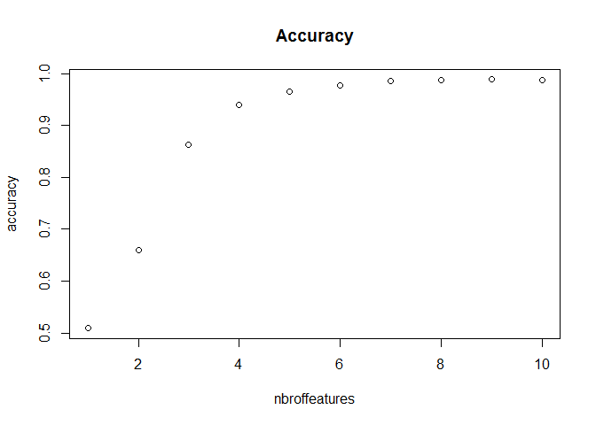
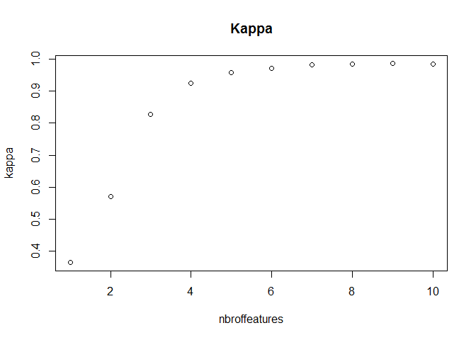

# Predicting correctness of barbell lifts
Gertlae  
Sunday, October 25, 2015  

# Executive Summary  

Our goal was to use data from 4 accelerometers placed on respectively the belt, forearm, arm, and dumbell of 6 subjects. They were asked to perform barbell lifts correctly and incorrectly in 5 different ways, classified as A, B, C ,D and E. Based on the measurements from the accelerometer sensors, we predict the class how the exercise was performed and compare it with the recorded classification in the data that was recorded through observation by experienced barbell lifting trainers.  
For this classification problem a random forest model was built depending on a selection of 9 measurements provided by the accelerometers. The model has an estimated out of sample error between 98,8% and 99,4%.  
The model was built using the dataset provided. This dataset was split into train (60%), test(20%) and validation(20%) datasets. The test set was used to tune the model. The validation set was used to estimate the out of sample error.

# The input data

The pml-training.csv contains the sample data and it will be called the sample dataset in the remainder. The pml-testing.csv contains the 20 cases to be predicted for the assignment. We will refer to this data as the quiz data. When looking at the sample we understand from [Velloso et al, 2013] that the data contains time windows, and features that aggregate the raw features collected from the four sensors per time window in each row where new window = 'yes'. For this assignment we drop the aggregate features and the window related features to keep the subject name, raw sensor observations and classe as columns in both the sample and quiz data.set. Both subject name and classe are loaded as factors.


This leaves us with two tidy data sets sample and quiz. Sample containing 19622 observations of 54 variables (aka features). Quiz containing 20 observations of 54 variables. Given the large size of the sample dataset, we split the sample data up in a train (60%), test(20%) and validation(20%) dataset. The model is built and tuned using train and test set. Validation is then used to estimate the out of sample error. Quiz will be used to submit for this assignment using the tuned model. The caret createDataPartition was used to split the data.   


# Building the model
As this is a classification problem and we want maximum accuracy, we decide to use a random forest model and build it using the caret R-package. First we build the ideal model by using the caret train function on the train dataset using all features. Given the large size of the train data set, we use the default cross validation settings of the train function. It took a night of processing to calculate the ideal model. 

```r
library(caret)
modFit = train(classe ~ ., data=train, method ="rf", prox = TRUE)
save(modFit, file = 'modfitfull.Rdata')
```


```
## Random Forest 
## 
## 11776 samples
##    53 predictor
##     5 classes: 'A', 'B', 'C', 'D', 'E' 
## 
## No pre-processing
## Resampling: Bootstrapped (25 reps) 
## Summary of sample sizes: 11776, 11776, 11776, 11776, 11776, 11776, ... 
## Resampling results across tuning parameters:
## 
##   mtry  Accuracy   Kappa      Accuracy SD  Kappa SD   
##    2    0.9853550  0.9814649  0.002470065  0.003125515
##   29    0.9868905  0.9834117  0.002055705  0.002592701
##   57    0.9775605  0.9716019  0.004237532  0.005357228
## 
## Accuracy was used to select the optimal model using  the largest value.
## The final value used for the model was mtry = 29.
```

As expected, the ideal model was large, it takes > 1Gb of internal memory. As expected it has very high accuracy and kappa on the test data set. 

```
##       Accuracy          Kappa  AccuracyLower  AccuracyUpper   AccuracyNull 
##      0.9979607      0.9974207      0.9959858      0.9991192      0.2844762 
## AccuracyPValue  McnemarPValue 
##      0.0000000            NaN
```

```
##           Reference
## Prediction    A    B    C    D    E
##          A 1115    0    0    0    0
##          B    1  759    3    0    0
##          C    0    0  679    1    1
##          D    0    0    2  642    0
##          E    0    0    0    0  720
```
In order to obtain a more workable model, we use recursive feauture elimination using the variable importance metric provided by the ideal model calculation. The 10 most important features for the ideal model are

```
##                     Overall       featurename
## roll_belt         100.00000         roll_belt
## pitch_forearm      62.30701     pitch_forearm
## yaw_belt           54.36177          yaw_belt
## magnet_dumbbell_y  45.99934 magnet_dumbbell_y
## magnet_dumbbell_z  44.70092 magnet_dumbbell_z
## roll_forearm       42.49760      roll_forearm
## pitch_belt         41.95830        pitch_belt
## accel_dumbbell_y   24.36399  accel_dumbbell_y
## accel_forearm_x    19.70234   accel_forearm_x
## roll_dumbbell      19.57838     roll_dumbbell
```

For each number of features, starting from 1 till 10 we determine the accuracy and kappa using the test data set. 

```r
search.term = vrank$featurename
maxfeatures = 10
results = NULL
for (i in (1:maxfeatures))
{
        cselection = NULL
        v = colnames(train)
        for (j in (1:i))
        {
        cselection = c(cselection, grep(paste("^",search.term, sep="")[j],v))
        }
        print(head(train[,c(cselection, length(train))],1))
        print(paste ("nbr of features = ", i, "starting on :", date()))
        modFitrfe = train(classe ~ ., data=train[,c(cselection, length(train))], method ="rf")
        prediction = predict(modFitrfe, newdata = test[,c(cselection, length(test))])
        results = c(results,i,confusionMatrix(prediction,test$classe)$overall)
        print(paste ("nbr of features = ", i, " ending on :", date()))
        
        
}
dfr = t(matrix(results,nrow = 8,ncol = 10))
colnames(dfr)= names(results) [1:8]
save(dfr, file = 'rferesults.Rdata')
```

  

We decide to use the model with the 9 most important features from the ideal model.

## Results
The expected out of sample error for the final model based on the 9 features is estimated using the validation data set.

```
##           Reference
## Prediction    A    B    C    D    E
##          A 1114    0    0    0    0
##          B    0  753    0    0    1
##          C    1    5  682    4    0
##          D    1    0    2  639    0
##          E    0    1    0    0  720
```

```
##       Accuracy          Kappa  AccuracyLower  AccuracyUpper   AccuracyNull 
##      0.9961764      0.9951641      0.9937014      0.9978584      0.2844762 
## AccuracyPValue  McnemarPValue 
##      0.0000000            NaN
```
We decide to use this model to submit the answers for the quiz data.

### References  

[Velloso et al, 2013] Velloso, E.; Bulling, A.; Gellersen, H.; Ugulino, W.; Fuks, H. Qualitative Activity Recognition of Weight Lifting Exercises. Proceedings of 4th International Conference in Cooperation with SIGCHI (Augmented Human '13) . Stuttgart, Germany: ACM SIGCHI, 2013.
